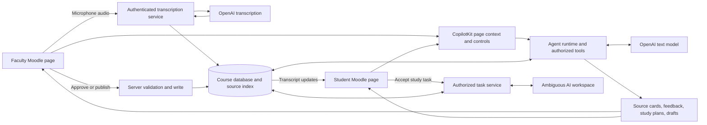

# Course Companion — Hackathon Implementation Plan

## 1. Product and build direction

**Working title:** Course Companion.  
**Purpose:** Help students understand a lecture without interrupting it, then turn assessment feedback into focused studying while reducing faculty assessment preparation and grading effort.

Build a working web prototype using a downloaded, sanitized AAU Moodle page as the visual starting point. Create separate **student** and **faculty** pages in one application, backed by the same course records. Preserve familiar course navigation, lecture resources, assignments, and grading views. Place the agent's controls within those activities.

The central interaction is:

**Live lecture → private, source-backed answer → written practice submission → provisional feedback → saved learning gap → practice from the instructor's slides.**

The faculty workflow uses the same course context to draft a short assessment from previous exams, review suggested grades, and publish discussion topics at a chosen level of specificity.

### Decisions and assumptions

- The demo uses two adapted Moodle pages; a browser extension is outside this plan.
- The Moodle layout is a reusable UI building block. The lecture pipeline, educational tools, persistence, and interaction between roles are new hackathon work.
- Describe the result as a **local prototype built around the AAU Moodle course experience**. A downloaded page does not establish a live Moodle API connection or university deployment.
- Use one course, one lecturer, two fictional students, one lecture, one slide deck, two previous assessments, and one short current assessment.
- Use the supplied **Physics I-61D** page as the layout reference and Physics I as the demo subject. Preserve Moodle's existing UI patterns for both roles.
- Keep responses and the professor avatar text based. Label the avatar **“AI teaching assistant, configured by your instructor.”** Its teaching style comes from instructor settings and materials.
- All timing and impact figures below are targets or assumptions until measured.

## 2. Why the environment matters

The course page supplies the selected course, lecture, assessment, teaching materials, and the user's permitted actions. The agent should resolve “What did that mean?” against the current lecture and “Help me prepare” against that student's feedback and the instructor's published preparation topics.

It must take visible actions in the course workflow: open a cited slide, save feedback against a submission, update a learning record, create study material, and present an assessment draft for faculty review. Switching the selected activity must change the agent's context. The student should not need to paste the entire course into a conversation.

The strongest demonstration of theme alignment is the connection between these records across both pages. Visual resemblance to Moodle alone provides little evidence of environment integration. Actual Moodle authentication, enrollment synchronization, and gradebook writes remain a later deployment step.

## 3. Scope for build day

| Priority | Deliverable | Smallest complete implementation |
| --- | --- | --- |
| P0 | Shared course environment | Student and faculty routes, real server-side role checks, shared persisted course data. |
| P0 | Live lecture Q&A | Faculty microphone capture, a transcript visible to students, private questions, answers citing transcript segments or slides. |
| P0 | Lecture archive | Final transcript survives reload and server restart; search and open a cited segment. |
| P0 | Feedback and study loop | Grade one short written response against a rubric, record a provisional learning gap, and generate linked practice from course slides. |
| P0 | Faculty assessment drafting | Generate and edit a three-question assessment using previous exams and teaching materials; save and explicitly publish it. |
| P0 | Discussion preparation | Generate faculty-reviewable topics from current and previous assessments with three specificity levels. |
| P0 | Faculty grading review | Show rubric evidence and suggested scores; faculty can edit, approve, or reject them. |
| P0 | Ambiguous AI study tasks | Accept a proposed practice task in Moodle, save it to Ambiguous, and read the same provider record after refresh. |
| P1 | Longer essays and batch grading | Reuse the grading contract with paragraph-level evidence and a review queue after the short-answer flow works. |
| P1 | Additional sponsor integrations | Add only a useful, verified integration with enough time to test it. |
| Later | Production LMS integration | Moodle plugin/API connection, university sign-in, roster import, and approved gradebook synchronization. |

Keep mobile apps, animated avatars, voice cloning, OCR, handwritten answers, plagiarism detection, and university-scale analytics outside the build-day scope. Retain all three original feature families by demonstrating one narrow example of each.

## 4. Student and faculty pages

### Shared Moodle shell

The supplied reference is [`Course_ Physics I-61D _ AAU Moodle.html`](<./Course_ Physics I-61D _ AAU Moodle.html>) with assets in `Course_ Physics I-61D _ AAU Moodle_files/`. Its HTML has been inspected. It contains the Physics I-61D course heading, a weekly outline, General, Quiz and Assignments sections, a navigation block, and course-dashboard links for activities, teachers, grades, and resources. The reference has been downloaded; adapting its UI and implementing functionality are still build work.

Preserve the navigation bar, course heading, weekly sections, activity rows, button styling, and grades/assignment interaction patterns. Match the downloaded CSS, spacing, typography, and icons when implementing. Use CopilotKit with custom/headless components inside these existing regions so the new interactions look like Moodle activities. [CopilotKit headless UI](https://docs.copilotkit.ai/custom-look-and-feel/headless-ui).

| Existing Moodle region | Student addition | Faculty addition |
| --- | --- | --- |
| Weekly outline | Live lecture activity with transcript and private question form. | Start/stop lecture and select teaching material. |
| Quiz and Assignments | Written submission, rubric feedback, and suggested practice. | Draft assessment, edit rubric, and publish. |
| Grades | Separate provisional feedback and reviewed score. | Suggested-score review table with edit/approve controls. |
| Course resources | Transcript archive and linked slide explanations. | Upload and classify slides and previous exams. |
| Course dashboard block | My study plan and accepted study tasks. | Published discussion topics and assessment status. |

Rebuild working controls as application components. Remove real student details, grades, session tokens, hidden form secrets, tracking scripts, and actions pointing at the university's live systems from any public demo derivative. Use local assets and fictional records. Record the template's origin and reusable asset attribution; keep the original reference out of the public repository unless sanitized.

Implement two routes sharing components and a backend:

- `/student/courses/[courseId]`: live lecture, private Q&A, transcript archive, assignments, feedback, and “My study plan.”
- `/faculty/courses/[courseId]`: course materials, lecture controls, assessment drafts, discussion topics, and grading review.

Use separate browser sessions for the two roles during the demo. The URL or a role selector must not grant faculty permissions.

### Student: understand the lecture without interrupting it

1. Open the active lecture from the course page. Show transcription status and the current slide/material.
2. Ask a question privately while the lecture continues. Private questions are not broadcast to other students or projected to the room.
3. The agent reads the recent finalized transcript and relevant course slides, then answers concisely with clickable source references.
4. A source reference opens the relevant transcript segment or slide page. If the materials do not support an answer, show that limitation and suggest a precise follow-up.
5. After the lecture, revisit the saved transcript and its sources from the same course page.

“Zero interruption” describes the intended interaction: no audible assistant responses, forced pauses, or public questions. It is not a promise that every question can be answered.

### Student: receive feedback and focused practice

1. Submit a short answer in an instructor-enabled practice activity.
2. Receive a **provisional AI score**, criterion-level feedback, evidence from the answer, and a suggested improvement.
3. The system saves the feedback, records the relevant concept observations, and generates a short study card from the instructor's slides.
4. The card contains the concept, why it needs practice, a cited explanation, one worked example, and two practice questions.
5. Choose **Add to my study plan** to accept a concrete study task. Save that task in Ambiguous AI and display it in the course dashboard, including after a fresh provider read on reload.
6. Submit another attempt. Show the new evidence and progress without claiming that one successful answer proves mastery.

For graded coursework, faculty control when provisional feedback becomes visible. Students can request review. Faculty-approved grades are stored separately from AI suggestions.

### Faculty: prepare and review an assessment

1. Upload slides, previous exams, and a rubric. Confirm extracted text, resource visibility, and a small list of course concepts.
2. Select topics, question types, difficulty, total marks, and assessment length.
3. Generate a three-question draft: two MCQs and one short written question. Include expected answers, a rubric, concept mapping, and the teaching sources used.
4. Validate mark totals, required coverage, answer/rubric consistency, and obvious copying from previous exams. Similarity checks flag potential reuse; they do not prove originality.
5. Edit the draft and click **Publish assessment**. The resulting assessment appears on the student page after refresh.
6. Review suggested grades alongside the actual submission and rubric. Edit, approve, or reject; an approval must create a persisted reviewed result.

### Faculty: publish discussion topics

Use current and previous assessments to draft preparation topics with a specificity setting:

| Setting | Example |
| --- | --- |
| Broad topics | Newton's laws, net force, and motion. |
| Learning objectives | Explain why constant velocity implies zero net force. |
| Skills and formats | Practice drawing a force diagram and justifying the net force in a short written answer. |

Faculty review the result before publishing it. Student study tools retrieve this approved outline, published materials, and released past papers. Unreleased questions, answer keys, and faculty-only drafts never enter the student assistant's retrieval context.

## 5. Sponsor tools and prize strategy

### Sponsor guidance and confirmed prize list

The official starter's sponsor guide identifies **OpenAI, CopilotKit, OpenRouter, Exa, Auth0, and Ambiguous AI** as its selected lineup. It explicitly distinguishes this from the full event roster. Its web template already supports page context and reviewed actions. [Official sponsor guide](https://github.com/CopilotKit/agents-everywhere-starter-kit/blob/main/using-sponsor-tools.md) · [Web starter](https://github.com/CopilotKit/agents-everywhere-starter-kit/blob/main/apps/web/README.md).

The following awards come from the **organizer prize text supplied by the user on September 12, 2026**. The research tool could not independently retrieve the participant portal, so attribute these details to that supplied text rather than claiming online verification.

| Award | Team award | Award for each team member |
| --- | --- | --- |
| Global First Place | $10,000 in OpenAI credits, $1,000 in Exa credits, and Exa swag. | A Mac mini. |
| Global Second Place | $5,000 in OpenAI credits, $500 in Exa credits, and Exa swag. | A pair of Ray-Ban Meta glasses. |
| Global Third Place | $2,500 in OpenAI credits, $250 in Exa credits, and Exa swag. | A LOOI Robot. |
| Best Use of Ambiguous AI | One NVIDIA DGX Spark. | No separate per-member award stated. |
| Best Use of CopilotKit | No separate team award stated. | A pair of purple AirPods Max. |

Exa swag allocation is not specified in the supplied text. Credit amounts are per winning team. The global competition includes participating cities and the virtual edition. The excerpt identifies two **Best Use** awards; it does not state that using OpenAI or Exa is mandatory for a global placement. Award stacking, separate entry forms, and additional eligibility conditions still depend on the organizer's full rules.

**Prize priorities:** First, deliver a strong global entry. Make **Best Use of CopilotKit** the primary sponsor target through course-aware interactions and Moodle-styled agent controls. Pursue **Best Use of Ambiguous AI** through a complete study-task workflow with a real external record and read-back.

### Planned core integrations

| Sponsor | Concrete role in this project | Evidence to capture |
| --- | --- | --- |
| CopilotKit | Supply course/activity context, render inline answer and feedback components, and connect faculty review controls to agent proposals. | Show context changing with the selected activity, useful rendered controls, and a reviewed action changing the course record. |
| OpenAI | Transcribe the live faculty microphone; run tool-capable reasoning for Q&A, grading feedback, study material, and assessment drafting. | A fresh utterance becomes a saved transcript segment; a text model calls a real course tool and returns a grounded result. |
| Ambiguous AI | Persist accepted study tasks derived from rubric gaps, with course/material references, and retrieve them within Moodle. | Accept one task, save it through the provider, refresh, and retrieve the same remote ID; decline another proposal and verify no write. |

CopilotKit supplies React UI and shared-state primitives suitable for this design. Use the starter's direct OpenAI model adapter and verify a real tool round trip with an available model. These implementation decisions target the awards; they do not guarantee selection. [CopilotKit documentation](https://docs.copilotkit.ai/) · [OpenAI function calling](https://developers.openai.com/api/docs/guides/function-calling).

### Ambiguous AI workflow

Example: feedback identifies confusion between velocity and acceleration. The agent proposes **“Review slide 3 and complete two net-force questions”** within the student's course page. The student accepts the proposed title, material links, and optional due date. A server action creates the Ambiguous task and stores its provider ID against that student's local study plan. Reloading reads the actual remote task and renders its current state in Moodle.

Use a team-controlled demo workspace and its documented connection flow. Discover the available task schema through the provider/starter adapter; never invent MCP tool names or record URLs. Expose proposal and authorized read tools to the agent; execute the external write through the explicit acceptance endpoint. Ambiguous manages its own workspace records, so course data and task ownership still need application-level mapping. [Ambiguous developer guide](https://www.ambiguous.ai/llms.txt).

Keep transcripts, submissions, grades, and learning evidence in the course database. Send the accepted task's minimal practice instructions and course references to Ambiguous. If the provider is unavailable, show an unsynced task and preserve the local study material; do not claim a successful sponsor integration. Demonstrate create, read-back, decline, and duplicate-request handling for the sponsor entry.

### Optional integrations, in order of product fit

| Sponsor | Useful addition | Adoption condition |
| --- | --- | --- |
| Auth0 | Student/faculty login backed by verified identity; enforce course permissions on the server. | Prefer if the team can configure its tenant promptly. The starter's machine-to-machine example does not implement student login. [Auth0 login documentation](https://auth0.com/docs/quickstart/spa/react). |
| OpenRouter | Alternative tool-capable model gateway if credits, access, or model choice improve the build. | Keep behind the model adapter; its use is optional because the supplied prize list names no separate OpenRouter award. Verify an actual tool call if enabled. [OpenRouter tool calling](https://openrouter.ai/docs/guides/features/tool-calling). |
| Exa | Find an additional public explanation for a difficult concept when the instructor enables supplementary sources. | Keep instructor slides primary; label external sources and send only a concept query. [Exa search documentation](https://exa.ai/docs/reference/search). |

Record the relevant award names, supplied prize text, demonstrated integration, required evidence, entry procedure, partner tags, and actual deadline in `SUBMISSION.md`. Installing a package, displaying a logo, or holding credits is not evidence of completed integration. Sponsor count is not one of the four supplied judging criteria.

## 6. Architecture

Start from the official starter's **web** application and adapt it to the AAU Moodle layout. Reuse its Next.js/React/TypeScript and CopilotKit wiring. Keep one application for both roles and shared server modules for course operations. Read the starter's `AGENTS.md` and web README when importing it, and retain its tested dependency lockfile. [Official starter repository](https://github.com/CopilotKit/agents-everywhere-starter-kit).



| Layer | Implementation choice |
| --- | --- |
| UI | Adapted Moodle shell, separate student/faculty routes, shared accessible React components. |
| Agent interface | CopilotKit page context, tool-driven cards, and explicit faculty review controls. |
| Backend | Next.js server routes and shared TypeScript services; a small Node WebSocket service for audio if needed. |
| Text inference | Starter-compatible direct OpenAI adapter with a verified tool-capable model; configurable model ID. |
| Transcription | Direct OpenAI transcription session; microphone capture starts only from faculty controls. |
| Storage | SQLite on persistent local disk, with schema migrations and a reproducible demo seed. |
| Study-task integration | Ambiguous task create/read via a server adapter, with provider IDs bound to authorized local student records. |
| Retrieval | Resource chunks with course/concept/access metadata; SQLite FTS5 plus the recent transcript window. |
| Documents | Text PDFs and plain text only; preserve page numbers and preview extraction before indexing. |
| Validation | Shared typed schemas for tool inputs, model outputs, scores, citations, and writes. |

FTS5 provides full-text retrieval without another hosted dependency. For the small demo course, combine lexical results with approved concept tags; add embeddings only if retrieval tests show a concrete gap. [SQLite FTS5 documentation](https://www.sqlite.org/fts5.html).

Run the primary demo on localhost with persistent storage. If hosting remotely, provide HTTPS and durable storage; an ephemeral filesystem does not meet the transcript archive requirement. Browser microphone access requires permission and a secure context, including localhost. [Browser microphone documentation](https://developer.mozilla.org/en-US/docs/Web/API/MediaDevices/getUserMedia).

## 7. Live transcription and course retrieval

Use `gpt-live-transcribe` if available to the team's API account. The documented transcription session emits partial and completed text, supports browser WebRTC or server WebSocket connections, and can consume 24 kHz PCM. It does not provide word timestamps, speaker labels, or confidence scores. Use application-recorded audio interval offsets for approximate segment timestamps and label them accordingly. [OpenAI realtime transcription](https://developers.openai.com/api/docs/guides/realtime-transcription).

Implement the lecture pipeline as follows:

1. Faculty start one capture session for the course lecture. Show recording status on both pages and the stop control on the faculty page.
2. Send audio through the authenticated transcription service, using an explicitly supported encoding. Do not assume arbitrary recorder fragments are independently decodable audio files.
3. Render partial transcript text temporarily. Reconcile completed segments by provider item ID and capture order rather than arrival order.
4. Persist finalized segments with lecture ID, sequence, approximate audio offsets, and transcript version. Index only finalized text for answers.
5. Broadcast transcript updates to enrolled students; keep student Q&A on separate private channels.
6. On stop, finish pending transcription, mark the lecture archived, and release the microphone. Keep the transcript and its citation IDs across restart.

For Q&A, retrieve a short recent transcript window plus a few relevant, authorized slide/transcript chunks. Cite only source IDs actually retrieved. If the transcript is behind, show its last update time; if sources conflict, surface the conflict. Instructor-approved slide material takes precedence over an obvious transcription error.

Provide a labeled prerecorded lecture replay for rehearsal and recovery. A replay exercises the same pipeline but must not be presented as live microphone capture. Use synthetic or team-recorded material; store transcripts durably and keep raw audio transient by default.

## 8. Agent behavior and tools

Use one shared agent runtime with three task modes: **lecture assistance**, **assessment preparation**, and **feedback/study support**. Each mode receives an allowlisted tool set. The selected page supplies context; the model selects evidence and appropriate next steps within those bounds.

The runtime follows `receive → retrieve → reason → validate → persist or request review → render`. Bound each run to a small tool budget, such as six tool calls, and at most one output-repair attempt. Show task status and results; store tool metadata rather than private model reasoning.

| Tool/service | Reads | Outcome and control |
| --- | --- | --- |
| `get_course_context` | Authorized course, activity, instructor settings, user membership. | Establishes context without accepting a client-supplied role. |
| `search_course_sources` | Final transcript and permitted resource chunks. | Returns stable source IDs, excerpts, page/segment locators, and versions. |
| `get_rubric` | Selected activity's rubric and allowed grading instructions. | Supplies versioned criteria to the grading workflow. |
| `evaluate_submission` | Immutable answer, rubric, relevant teaching evidence. | Produces a score proposal and criterion-level evidence; never approves a final grade. |
| `save_feedback` | Schema-validated proposal for an authorized submission. | Saves provisional feedback and concept observations atomically. |
| `create_study_plan` | Student concept observations and published slides. | Persists a cited study card and practice questions for that student. |
| `propose_study_task` | A saved study plan and its cited practice material. | Renders an editable task proposal for the student to accept. |
| `read_study_tasks` | Provider IDs mapped to the authenticated student's course tasks. | Reads actual Ambiguous records and renders their current state. |
| `draft_assessment` | Faculty-only past papers, teaching scope, requested blueprint. | Creates an editable draft with answers, marks, and rubric. |
| `draft_discussion_topics` | Faculty assessment context and specificity setting. | Creates a preparation outline awaiting faculty publication. |
| `open_source` | Validated, user-accessible source locator. | Opens the cited slide or transcript segment in the course UI. |

Publishing assessments/topics and approving grades use dedicated faculty UI actions and server endpoints. Saving a task to Ambiguous uses the student's **Add to my study plan** acceptance action. The model cannot approve its own proposal. Saving private practice feedback and local study material is part of the student's requested feedback workflow and needs no repeated confirmation.

### Output and grounding contracts

- **Q&A:** answer text, source references, and `supported` or `insufficient_evidence` status.
- **Feedback:** submission/rubric versions, criterion scores, maximums, answer excerpts, feedback, concept IDs, source references, and review flags. Compute the total in code and check each score against its bounds.
- **Study material:** concept ID, evidence references, cited explanation, worked example, practice questions, and saved plan ID.
- **Assessment draft:** question type, prompt, options where relevant, faculty-only expected answer, marks, concept IDs, rubric, and source references.

Use the selected provider's supported structured/tool output format, then validate again on the server. Schema conformance does not establish grading accuracy. The direct OpenAI text adapter should use strict function schemas; if OpenRouter is enabled, validate its supported schema behavior separately. [OpenAI function calling](https://developers.openai.com/api/docs/guides/function-calling).

### Learning-gap records

Record evidence against concepts rather than assigning a permanent label to a student. A low criterion score can create a **“needs practice — provisional”** observation. Two independent attempts can support a recurring-gap indicator. Store the submission, rubric criterion, source version, and time behind every observation.

An instructor correction replaces the affected observation and regenerates dependent study material. Retrying a request must not create another observation for the same submission version. A question asked during a lecture does not, by itself, establish a weakness.

## 9. Persistence and API boundaries

| Record | Essential fields |
| --- | --- |
| Users and enrollments | User ID, course ID, server-assigned role. |
| Course resources and chunks | Course ID, kind, visibility, version, checksum, text, page number, concept IDs. |
| Lectures and transcript segments | Course ID, capture state, item ID, sequence, offsets, finalized text, version. |
| Private Q&A | Student ID, lecture ID, question, answer, source references. |
| Assessments | Course ID, blueprint, questions, protected answers/rubric, version, draft/published state. |
| Submissions and feedback | Student/activity IDs, immutable answer/version, provisional result, reviewed result, reviewer. |
| Concept observations and study plans | Student/course/concept IDs, supporting feedback IDs, evidence state, cited material. |
| Study tasks and synchronization | Student/course/plan IDs, accepted payload, provider record ID, write-intent ID, sync state, last provider read. |
| Discussion outlines | Course/assessment IDs, specificity, draft content, approved published content. |
| Agent runs | Request ID, tool names, model/provider, source IDs, latency, result IDs, outcome. |

Define routes around these records: lecture start/stop and transcript subscription; private Q&A; resource upload; submission and feedback; personal study plans; study-task accept/read; assessment draft/publish; topic draft/publish; and grade review. All entry points, including agent tools, downloads, and streaming connections, enforce membership and ownership on the server.

Use an idempotency key for submission processing, publication, and grade approval. Commit related feedback and concept updates together. Return a saved record ID and read it back to prove completion. Persist job state so a restart marks interrupted work as retryable instead of leaving a permanent loading state.

For Ambiguous task creation, persist a write intent before the external request and its provider ID afterward. Do not assume task endpoints support idempotency without checking their schema. If a network failure leaves the outcome uncertain, reconcile with the provider using supported lookups before retrying; otherwise show a verification-needed state rather than create a possible duplicate.

## 10. Reliability and appropriate user control

| Situation | Required behavior |
| --- | --- |
| Microphone permission denied | Explain the capture status; allow another attempt or the labeled replay. |
| Transcription disconnects | Preserve completed segments, show the gap, and resume without duplicating text. |
| Model timeout or malformed output | Preserve the question/submission, bound retries, show a recoverable error, and avoid incomplete writes. |
| Unsupported or image-only PDF | Show extraction failure and allow a text replacement; do not silently index an empty document. |
| Insufficient grading evidence | Flag for review without inventing evidence or recording an unsupported learning gap. |
| Student requests another student's results or a faculty draft | Deny access before retrieval or model inference. |
| Prompt-like instructions inside an exam, slide, or essay | Treat them as source content; do not let them change roles, tools, or grading instructions. |
| Faculty rejects a proposal | Preserve the draft if useful; publish no assessment or approved grade. |
| Student declines a study task | Create no Ambiguous record. |
| Ambiguous is unavailable or a write outcome is uncertain | Keep local practice accessible and show pending/verification-needed status; never invent a remote ID or claim sync success. |

Apply access filters before retrieval and before returning any saved result. Do not mix faculty-only exams into student prompts and then rely on an instruction to hide them. Release flags govern current assessments, past papers, and feedback separately.

Use fictional data in the public demo. Explain transcription and archiving in the lecture UI, with instructor-controlled recording and an archive deletion mechanism. Persistent storage supports future studying; it should not imply that data can never be removed. Keep all sponsor secret keys server-side.

For a local demo, seeded accounts can provide separate authenticated roles. If Auth0 is adopted, connect actual user login and server authorization. Neither approach should claim university single sign-on.

## 11. Build sequence and time limits

Confirm the submission deadline in the team's own portal first. The schedule below is a **seven-hour planning budget**, not a verified local timetable; compress it against the actual remaining build time and reserve the final hour for submission work.

| Elapsed budget | Work | Exit condition |
| --- | --- | --- |
| 0:00–0:30 | Read/import the web starter, record inherited code, check sponsor access, prepare fictional Physics I fixtures. | One text tool call, one microphone transcription, and one Ambiguous task create/read succeed. |
| 0:30–1:15 | Adapt the Moodle shell; add student/faculty routes, shared records, and authentication boundaries. | Both roles open the same course; student access to faculty data is denied. |
| 1:15–2:45 | Build capture, transcript persistence, slide ingestion, retrieval, and private Q&A. | A fresh spoken sentence can support a cited answer and survives refresh. |
| 2:45–4:00 | Implement one rubric, written submission feedback, concept observations, study cards, and accepted Ambiguous tasks. | One submission creates saved feedback and cited practice; an accepted task can be read back from Ambiguous. |
| 4:00–5:00 | Implement assessment drafts, discussion specificity, publication, and grade review. | A faculty-published activity appears on the student page. |
| 5:00–6:00 | Run acceptance checks, resolve failures, and rehearse the joined workflow. | Core paths and relevant failure cases pass. |
| 6:00–7:00 | Freeze scope, record the video, finish repository instructions and submission fields. | All five required deliverables are ready before the actual deadline. |

If time is short, cut optional sponsor integrations, batch grading, long essays, elaborate styling, and dashboard charts first. Retain shared course state, real model calls, one live transcription demonstration, one feedback-to-study loop, the accepted Ambiguous task, and a small faculty assessment workflow. If provider access prevents a sponsor workflow from working, disclose that limitation and do not enter a Best Use claim based on a simulation.

## 12. Judging criteria and evidence

Use the four supplied criteria, each scored 1–5. These are evidence commitments, not predicted scores.

| Criterion | What this project should demonstrate |
| --- | --- |
| Core Requirements & Functionality | Both pages operate on persisted course data. Lecture Q&A, grading feedback, study material, and faculty publication each finish with a visible result. |
| Innovation & Theme Alignment | The current lecture explains an ambiguous question; a student's actual rubric gap selects the relevant slide and next practice; faculty actions appear in the student's course. Explain the local Moodle prototype boundary accurately. |
| Technical Execution & Integration | Real sponsor API calls, validated tools, source citations, role separation, transcript reconciliation, idempotent writes, and an accepted study task read back from Ambiguous. |
| Usefulness & Agentic Experience | Students ask privately and receive actionable practice; faculty review drafts and scores with control over publication. Show a complete action and its saved outcome. |

## 13. Acceptance checks

Run meaningful integration checks for permissions, persistence, and grading, followed by a manual rehearsal in the actual demo browser. The document itself does not establish that any of these checks have passed.

- [ ] A new microphone utterance appears on the student page; stopping the lecture releases capture.
- [ ] A private question receives an answer supported by a real transcript/slide citation; opening the citation works.
- [ ] A question beyond the available materials produces an evidence limitation.
- [ ] Transcript, submission, feedback, and study plan remain after browser reload and backend restart.
- [ ] A duplicate submission request produces one feedback result and one set of concept observations.
- [ ] A rubric-scored short answer yields a valid total and an appropriate cited study activity.
- [ ] Instructor correction updates the reviewed result and dependent concept evidence.
- [ ] A generated assessment meets its blueprint and mark total; explicit publication makes it visible to the student.
- [ ] All three discussion specificity settings work and publish only faculty-reviewed content.
- [ ] Student requests for another student's profile, unreleased exam, answer key, and faculty approval endpoint fail.
- [ ] A model timeout and a rejected faculty proposal cause no unintended publication.
- [ ] Each claimed sponsor integration has at least one successful live call and a visible result.
- [ ] Accepting a study task creates a real Ambiguous record; refreshing reads the same remote ID. Declining creates no record, and retrying does not duplicate it.
- [ ] The new student and faculty controls follow the supplied Moodle page's weekly sections, activity rows, navigation, and visual styling.

Prepare ten small evaluation examples: four lecture questions, four short answers spanning rubric quality, and two insufficient-evidence cases. Compare the grading examples with instructor/team reference scores and inspect the cited evidence. Report the sample size; this is a demo check, not validation for high-stakes grading.

Provisional responsiveness targets are transcript updates within five seconds of a short utterance, Q&A within ten seconds, and a short-answer feedback/study result within twenty seconds. Measure actual timings on the demo setup and report them honestly. These targets are not provider guarantees.

If the official web starter is used, run its `npm run verify` and `npm run build --workspace web`, plus the new integration checks. Document actual startup commands and additional transcription-service requirements after implementation.

## 14. Impact estimates and defensible claims

Treat the user's university figures as an illustrative scenario, not measured AAU statistics or established university averages.

### Assessment authoring

Assumptions: 40 instructors, seven unique assessments per instructor per semester, a 13-week semester, and preparation falling from seven hours to one hour **including review and editing**.

```text
Projected hours saved/week = 40 × 7 × (7 − 1) / 13 = 129.23
```

Use **“approximately 129 faculty hours per week projected under our assumptions.”** Validate the seven-to-one-hour reduction by timing comparable preparation tasks with instructors.

### Grading

Assumptions: seven minutes per submission, seven assessments per course, 35 students per course, four courses per instructor, 40 instructors, and 13 weeks.

```text
Submissions/semester = 7 × 35 × 4 × 40 = 39,200
Current grading workload/week = 7 × 39,200 / 60 / 13 = 351.79 hours
Projected savings/week = (7 − review_minutes) × 39,200 / 60 / 13
```

The original approximately **352 hours/week is baseline workload**, not established savings. An illustrative reduction to two minutes of human review would save approximately **251 hours/week**, before extra overhead. Validate review time and grading quality before using a savings claim.

The authoring estimate counts seven assessments **per instructor**; the grading estimate counts seven **per course across four courses**. Resolve whether assessments are shared across courses before combining the estimates. Do not present the two figures as a validated combined university saving.

Student value hypotheses are faster access to explanations, a private way to ask questions, and clearer next study steps. Measure usefulness with students; do not claim a measured reduction in social anxiety or improved academic attainment from this prototype.

## 15. Two-minute demonstration

Use one coherent fictional lesson within **Physics I-61D — Newton's laws: net force, acceleration, and constant velocity**. Prepare a five-slide deck, two past assessment samples, a current practice question, and a four-point rubric. Keep faculty and student sessions open together.

Practice prompt: “An object moves at constant velocity. What is its net force? Explain.” Award one point each for identifying zero acceleration, applying Newton's second law, concluding zero net force, and explaining that individual forces may still balance. A submission claiming that constant motion requires a nonzero net force produces a useful, demonstrable practice need.

| Video time | Demonstration |
| --- | --- |
| 0:00–0:12 | Show both Moodle-based pages. State the problem: students miss explanations while faculty spend time authoring and grading. Identify the local prototype. |
| 0:12–0:32 | Faculty speak a fresh example about an object moving at constant velocity while its forces balance. Show the transcript arriving on the student page. |
| 0:32–0:50 | Student privately asks how it can keep moving with zero net force. Show the AI answer and open its transcript or slide citation. |
| 0:50–1:16 | Student submits a short answer confusing velocity with acceleration. Show feedback and cited practice, then accept the proposed study task in Moodle. |
| 1:16–1:42 | Switch to faculty: inspect the suggested score, approve/edit it, and show a three-question draft created from the past papers. Publish the reviewed assessment and preparation topics. |
| 1:42–1:54 | Refresh the student page: the new activity and topics appear. Read the accepted task from Ambiguous and show the saved transcript. |
| 1:54–2:00 | Name the sponsor tools actually used, show the repository link, and state one clearly labeled impact projection. |

Prepare source files and authenticated sessions before recording. Label any replayed audio, pre-generated draft, or shortened wait. Demonstrate at least one new question and one real write/read-back; do not script hardcoded AI responses for the main path.

## 16. Submission and build eligibility

The supplied handbook requires a new project whose core functionality is built during the official event. Templates and libraries are permitted building blocks. Keep a record of the downloaded Moodle shell and starter components, then identify the newly built educational interaction and data flows. The team's local portal controls the deadline and organizer updates. [Official starter rules summary](https://github.com/CopilotKit/agents-everywhere-starter-kit/blob/main/hackathon-rules.md).

- [ ] **Title:** Course Companion, or the team's final chosen name.
- [ ] **Written description:** Explain the student/faculty problem, complete workflow, essential course context, and prototype boundary.
- [ ] **Public GitHub repository:** Working code, setup instructions, environment-variable names, fictional fixtures, architecture, checks, limitations, and inherited-versus-new work. Exclude secrets and private university exports.
- [ ] **Two-minute demo video:** Verify duration, visibility, audio, and a complete interaction.
- [ ] **Social media post:** Include the project/demo link and exact partner tags required by the organizer. Verify handles rather than guessing them.
- [ ] **Sponsor evidence:** Document CopilotKit's contextual UI and Ambiguous's task create/read/decline flow, retain the supplied award details, and verify any remaining entry conditions or award-stacking rules.
- [ ] **Portal submission:** Check all links and submit before the actual deadline shown for the team.

Suggested description to update against the finished build:

> Course Companion brings a teaching and study agent into a Moodle-based university course experience. Students can ask private questions during a lecture, revisit a cited transcript, and turn rubric feedback into focused practice from their instructor's slides. Faculty can draft assessments from past papers, publish preparation topics, and review AI-suggested grades. CopilotKit connects these interactions to the current course activity, OpenAI powers transcription and reasoning, and Ambiguous AI stores accepted study tasks. The prototype connects separate student and faculty pages through shared course records, with source references and human control over assessment publication and final grading.

### Completion standard

The build is complete when a fresh lecture question is answered from course evidence, a written submission creates persisted feedback and study material, an accepted task can be read back from Ambiguous, and a faculty-reviewed assessment appears on the student page. All claimed integrations must execute, role boundaries must hold, and the submission must distinguish working functionality, reused infrastructure, and future Moodle deployment work.
